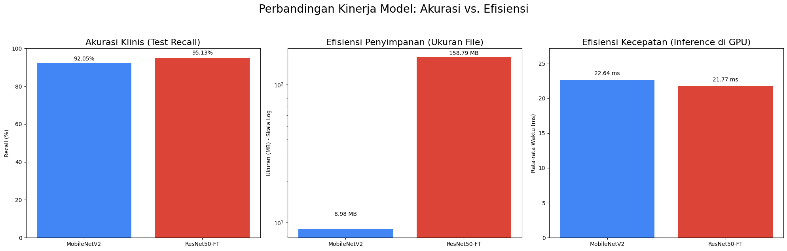
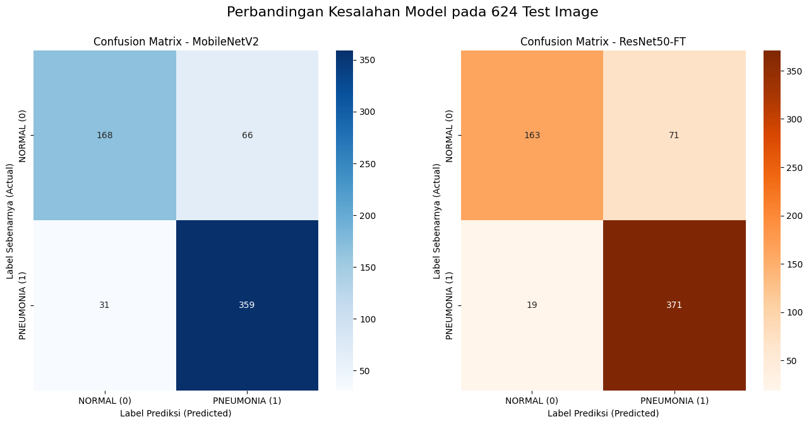

# Analisis Komparatif Model Deep Learning untuk Deteksi Pneumonia 🩺

Repositori ini berisi notebook dan hasil dari penelitian untuk membandingkan performa arsitektur model Deep Learning dalam tugas klasifikasi citra X-Ray dada untuk mendeteksi Pneumonia. Tujuan utamanya adalah menganalisis *trade-off* antara akurasi klinis (Recall) dan efisiensi komputasi (ukuran model & kecepatan inferensi).

*Perbandingan performa antara MobileNetV2 dan ResNet50-FT*

## 📂 Struktur Repositori
- **/notebooks:** Berisi notebook Google Colab (`.ipynb`) yang mencakup semua tahapan, mulai dari preprocessing data hingga pelatihan, evaluasi, dan analisis model.
- **/models:** Folder ini **kosong** di repositori. File model yang telah dilatih dapat diunduh secara terpisah (lihat bagian di bawah).
- **/results:** Berisi output akhir dari penelitian, termasuk file CSV rangkuman dan plot perbandingan.

## 💾 Unduh Model yang Telah Dilatih

Karena ukurannya yang besar, file model tidak disertakan langsung di repositori GitHub ini. Anda dapat mengunduhnya dari tautan Google Drive berikut:

1.  **MobileNetV2 (9 MB):** `https://drive.google.com/file/d/1SgIMwjuewDmQclKuXOjQlvhIv_zIeA95/view?usp=sharing`
2.  **ResNet50-FT (159 MB):** `https://drive.google.com/file/d/1-mCX9bNtfNlO8M9m6UYEcOsYAgDlWBpZ/view?usp=drive_link`

**PENTING:** Setelah mengunduh, tempatkan kedua file tersebut ke dalam folder `/models/` secara lokal agar notebook dapat menemukannya jika Anda ingin menjalankan inferensi. Pastikan pengaturan *sharing* di Google Drive adalah "Anyone with the link can view".

## 🔬 Temuan Kunci

Penelitian ini membandingkan `MobileNetV2` (baseline ringan), `EfficientNetB0` (modern ringan), dan `ResNet50` (baseline berat).

1.  **Stabilitas Model:** `MobileNetV2` terbukti paling stabil dan berhasil dilatih dengan metode *feature extraction* sederhana. Sebaliknya, `EfficientNetB0` dan `ResNet50` gagal total dengan metode ini dan memerlukan teknik yang lebih canggih (`class_weight` dan `fine-tuning`) untuk bisa konvergen.
2.  **Trade-Off Akurasi vs. Efisiensi:**
    - **`ResNet50-FT`** mencapai **Recall tertinggi (95.13%)**, yang berarti paling baik dalam meminimalkan kasus yang terlewat (*false negative*). Namun, biayanya adalah ukuran model yang **17x lebih besar** (159 MB).
    - **`MobileNetV2`** menawarkan performa yang sangat solid (**Recall 92.05%**) dengan ukuran hanya **9 MB**, menjadikannya kandidat ideal untuk aplikasi di perangkat dengan sumber daya terbatas (*edge computing*).
3.  **Kecepatan Inferensi:** Menariknya, saat diuji pada GPU (Google Colab T4), `ResNet50-FT` (21.77 ms) sedikit **lebih cepat** daripada `MobileNetV2` (22.64 ms), membuktikan bahwa arsitektur GPU modern sangat dioptimalkan untuk operasi matriks besar.

### Hasil Kuantitatif Akhir
| Model         | Metode Pelatihan    | Recall (Test) | Precision (Test) | Accuracy (Test) | Ukuran File (MB) | Waktu Inferensi (ms, GPU) |
| :------------ | :----------------- | :-----------: | :--------------: | :-------------: | :------------: | :-----------------: |
| **`MobileNetV2`** | Feature Extraction |    92.05%     |      84.47%      |      84.46%     |      **9.0** |        22.64        |
| **`ResNet50-FT`** | Fine-Tuning      |   **95.13%** |      83.94%      |      85.58%     |     158.8      |       **21.77** |
| `EfficientNetB0`| Gagal Total        |      N/A      |       N/A        |       N/A       |      15.4      |         N/A         |

*Perbandingan kesalahan yang dibuat oleh kedua model yang berhasil*

## Dataset Digunakan

Dataset yang digunakan adalah [**Chest X-Ray Images (Pneumonia)**](https://www.kaggle.com/datasets/paultimothymooney/chest-xray-pneumonia) dari Kaggle, yang berisi 5,863 gambar X-Ray yang telah dilabeli. *(Catatan: Dataset itu sendiri tidak disertakan dalam repositori ini karena ukurannya).*

## Langkah Selanjutnya

Model yang dilatih dalam penelitian ini digunakan untuk membangun **Aplikasi Web PANDA**, alat bantu diagnostik *full-stack*. Lihat repositori terpisah: `[Link ke Repositori PANDA-WebApp Anda - TAMBAHKAN NANTI]`